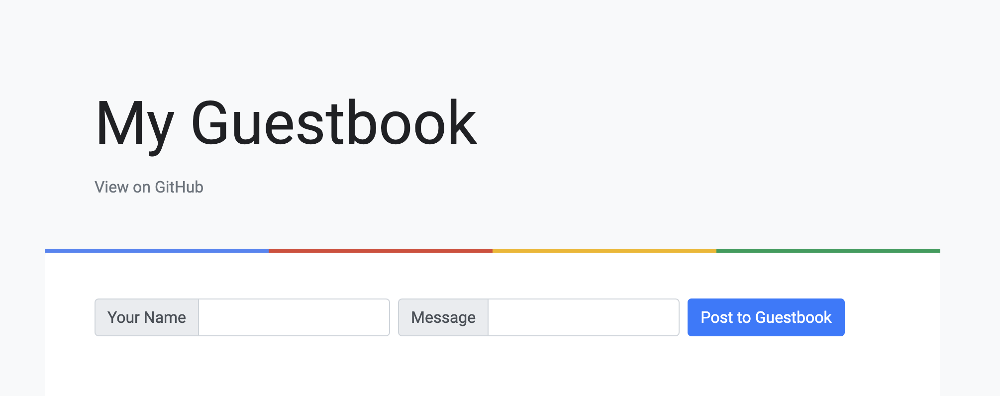

# Running the code locally

This document shows you how to run all locally without Docker or Minikube.

## Requirements

You need to install the following:

* [Python](https://www.python.org/) 3.11 or up
* [MongoDB Community Edition](https://www.mongodb.com/docs/manual/administration/install-community/)
* [Visual Studio Code](https://code.visualstudio.com/)
* [gcloud CLI](https://cloud.google.com/sdk/gcloud)
* [Optional but recommended] [Semgrep](https://semgrep.dev/)

## MongoDB

Make sure that MongoDB configuration is sound. For where to find it, look at [MongoDB's Configuration File Options documentation](https://www.mongodb.com/docs/manual/reference/configuration-options/)


```bash
cat /path/to/mongod.conf
```

Expected:

```text
systemLog:
  destination: file
  path: /usr/local/var/log/mongodb/mongo.log
  logAppend: true
storage:
  dbPath: /usr/local/var/mongodb
net:
  bindIp: 127.0.0.1, ::1
  port: 27017
  ipv6: false
```

### Check that is running

```bash
ps axww | grep mongodb | grep -v grep
```

Expected (similar):

```text
76041   ??  S      0:01.87 /usr/local/opt/mongodb-community/bin/mongod --config /usr/local/etc/mongod.conf
```

## Backend

First you need to run the backend:

```bash
export GUESTBOOK_DB_ADDR="127.0.0.1:27017"
PORT=8081 python ./src/backend/back.py
```

## Frontend

Once the backend is up, start the frontend:

```bash
export GUESTBOOK_API_ADDR="127.0.0.1:8081"
PORT=8080 python ./src/frontend/front.py
```

## Validate it is working

Just hit the browser on the frontend endpoint: [http://127.0.0.1:8080](http://127.0.0.1:8080)

You should see something like below:


