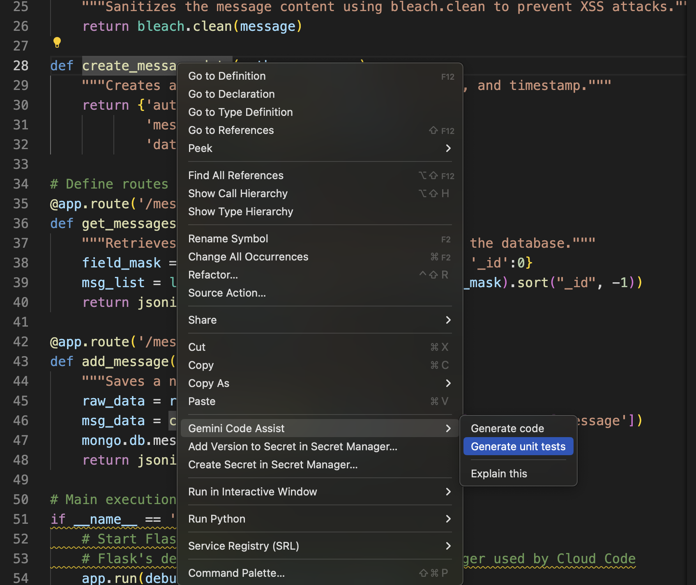

# Some Gemini prompts to try

If you want to follow along from the start we provide some branches to guide you through:

* `main`: Final code, all changes incorporated
* `steps/0_starting_point`: The code with minimal changes to run locally, the source is in [Guestbook with Cloud Code](https://github.com/GoogleCloudPlatform/cloud-code-samples/tree/v1/python/python-guestbook)
* `steps/1_logo_created`: Just added the logo in ``src/frontend/static/gemini_logo.jpeg``
* ``steps/2_refactoring``: Refactoring suggestions for ``src/backend/back.py``
* ``steps/3_logo_added``: Added the logo to the HTML
* ``steps/4_csrf_fixed``: Fixed the [CSRF vulnerability](https://owasp.org/www-community/attacks/csrf)

## Not *really* code assist, but still

Git guidance:

* Starting branch: ``steps/0_starting_point``
* Ending branch: ``steps/1_logo_created``

Let us create a new logo for the application.
For that we are going to use [Gemini Advanced](https://gemini.google.com/)

### Basic instructions

```text
Please create a logo for a guestbook web application
```

### Ask for some tuning

```text
Make the logo clean and simple, yet recognisable
```

### Ask to add a branding/cooperation

Note: you should change it to your brand.

```text
This application should also evoke the Google brand and identify the application as a guestbook
```

We've got this:


Save the one you like in ``src/frontend/static/gemini_logo.jpeg``, we are going to use it later.

### Try your own fine tuning

Try to get closer by giving specific instructions.

## Now code assist itself

Below are a couple of prompts to try out on this code base.

### Explain code

Git guidance (no change):

* Starting branch: ``steps/1_logo_created``
* Ending branch: ``steps/1_logo_created``

To explain a particular code, just select the file and ask for it. For example:

Select the file ``src/backend/back.py`` and type

```text
Please give me a high-level explanation of what this code does
```

### Refactoring

Git guidance:

* Starting branch: ``steps/1_logo_created``
* Ending branch: ``steps/2_refactoring``

Let us ask for Gemini to improve maintainability. Select the ``src/backend/back.py`` or ``src/frontend/front.py`` file and ask:

```text
Could you please refactor the code to be better organized. Do not truncate any responses. Output the refactored file
```

#### [Optional] Add some tests

Optionally, especially if Gemini returned functions in the refactored code, we can ask it to generate Unit Tests for sections:

1. Highlight the function to be tested.
2. Right-click -> `Gemini Code Assist` -> `Generate Unit Tests`.

The generated snippets might not be fully complete, but can be used to build a test suite for the application.



### Let us add the new logo

Git guidance:

* Starting branch: ``steps/2_refactoring``
* Ending branch: ``steps/3_logo_added``


We generated a brand new logo up there. 
Now is the time to incorporate it.
We assume you saved the logo as ``src/frontend/static/gemini_logo.jpeg`` for this example.
Select the file ``src/frontend/templates/home.html`` and ask the following:

```text
Please add the logo src/frontend/static/gemini_logo.jpeg to the title
```

Oops, it ate the title out, let us put it back:

```text
Please add the title (left to the logo): "My new Guestbook"
```

### How about the outer loop?

Git guidance:

* Starting branch: ``steps/3_logo_added``
* Ending branch: ``steps/4_csrf_fixed``

Let us assume that your code got submitted and your CI/CD ran [Semgrep](https://semgrep.dev/) for static security analysis.

#### Run Semgrep

```bash
semgrep ci
```

You will find a violation that is a bit cryptic about ``csrf_token``.
It does not, however, give you a good recipe to fix it. 
Let us try Gemini.

#### Let us fix it

Select the file ``src/frontend/front.py`` and ask:

```text
Please add CSRF protection
```

It should generate snippets for the Python code as well as the HTML code.

#### Is it there at all?

Re-run the frontend (see instructions in [LOCAL_RUN.md](./LOCAL_RUN.md)) and open your browser at [http://localhost:8080](http://localhost:8080).

Ask for to view the source page and you should see the following snippet:

```html
    <div class="container posts mt-0">
            <form class="form-inline" method="POST" action="/post">
            <input id="csrf_token" name="csrf_token" type="hidden" value="IjMwNWI0NzIxZmU2MTRiOWMyMGY1NTE4YWQzNmRmNzhmM2FmNzE5YTki.ZlXAsA.uIenYsnVxq7KGzBCnZlguZYtFHw">
            <label class="sr-only" for="name">Name</label>
            <div class="input-group mb-2 mr-sm-2">
```

#### Run Semgrep again

Let us check the fix:

```bash
semgrep ci
```

* Q: Oops, is still being flagged, but why? 
* A: Because, in this case, you need to tell Semgrep that you fixed it.
* Q: How?
* A: Just add the following comment before the open `<form>` tag, like below:

```html
    <div class="container posts mt-0">
<!-- ok: django-no-csrf-token -->
            <form class="form-inline" method="POST" action="/post">
            {{ form.hidden_tag() }}
            <label class="sr-only" for="name">Name</label>

```

Re-run Semgrep and it should have been marked as fixed.
